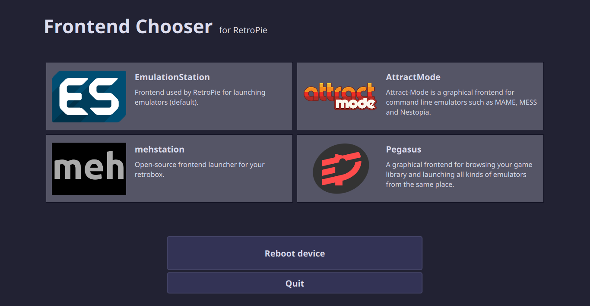

# Frontend Chooser for RetroPie

This is a graphical utility for installing various emulator frontends for [RetroPie]() and choosing which one to start on system startup.

## Installation

The latest releases can be found [HERE](https://github.com/mmatyas/retropie-frontendchooser/releases/tag/continuous). Download the package for your device, extract its contents and start the program as root (eg. `sudo /path/to/retropie-frontendchooser`).

- Use the version with `rpi1` in its name on Raspberry Pi 1 and Zero
- Use the `rpi2` one on Raspberry Pi 2 and 3
- Use `x11` on desktop Linux (ie. Ubuntu)
